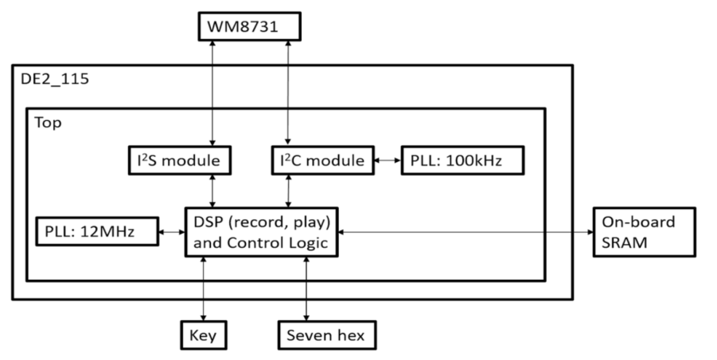

# Function:
- Record, play, pause, stop, reverse
- The sampling value is 16-bit signed, and the recording time is up to 32 seconds
- Supports fast playback (2, 3, 4, 5, 6, 7, 8 times) and slow playback (1/2, 1/3, 1/4, 1/5, 1/6, 1/7, 1 /8x speed)
- Two modes of zero-time interpolation and one-time interpolation should be included during slow playback

# Architecture:

## I2C:
- Initialize WM8731
- Operates with 100kHz clock

## I2S Modules
- Receive and transmit audio

## DSP
- Operation with signed signal
- fast play
- slow play
