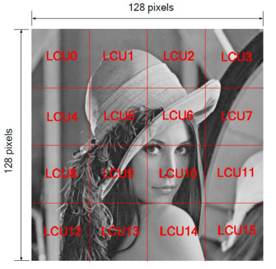
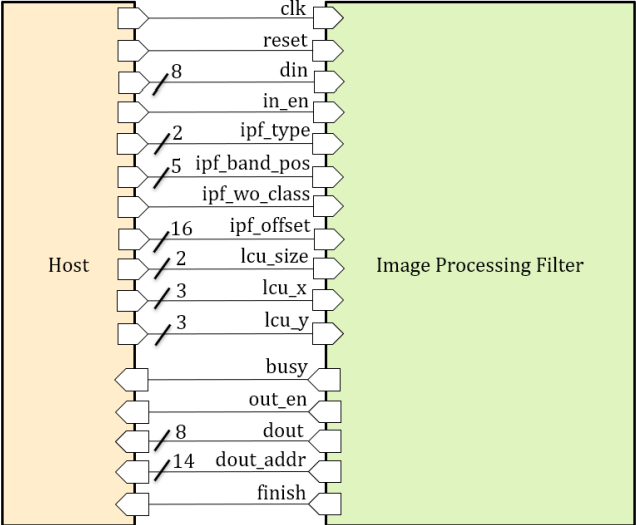

# Introduction:

 
Designed an Image Processing Filter (referred to as IPF hereinafter), the input is an image that has been divided into multiple LCUs (as shown in Figure 1), the image size is fixed at 128x128 Pixels, and the LCU Size is 16x16, 32x32, 64x64 Three possibilities. 16x16 and 64x64 are public test data, and 32x32 is hidden test data. IPF performs independent calculation on each LCU. Finally, after processing the entire image, pull the finish signal to High, and the system will automatically compare the entire image data. correctness. The definition of LCU and the detailed operation method of IPF will be described later.

# Architecture

