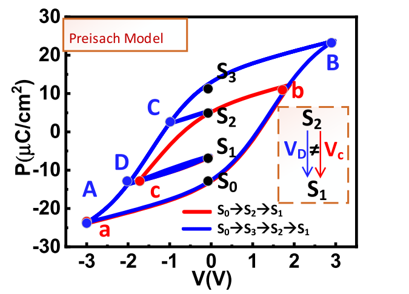
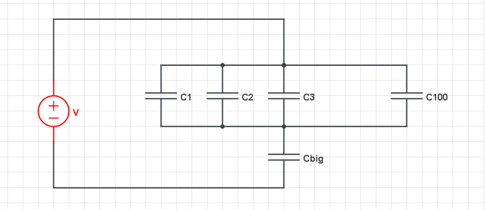

# History Effect:

Two minor loops are simulated by the Preisach model: smaller red (S0 →S2 →S1) and larger blue (S0 →S3 →S2 →S1). Both paths have thetransition from S2 toS1. However, the smaller red minor loop takes less voltage (Vc < VD).[1]

# Motivation
Though the multidomain Preisach model can emulate the minor loop empirically, it lacks aphysical explanation of the history effect.

# Simulation

Connect 100 MFM capacitors in parallel, and then connect a huge capacitor (about 300,000 times the size of the MFM capacitor) in series with the 100 MFM capacitors. The purpose of adding this large capacitor is to observe the total charge of the 100 MFM capacitors. Because each MFM capacitor can only see its own charge, so adding a large capacitor is to observe the sum of these charges (so I could observe the Qtotal-V of these 100 MFM capacitors in parallel). The capacitor is large enough so it's influence on the voltage can be ignored (when 4V is applied to both ends of the circuit, the two ends of the large capacitor are less than 0.0003V)

