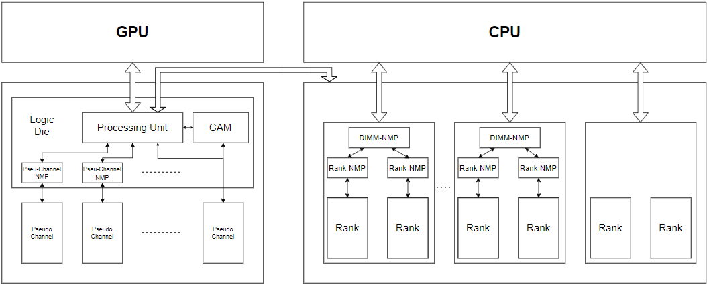
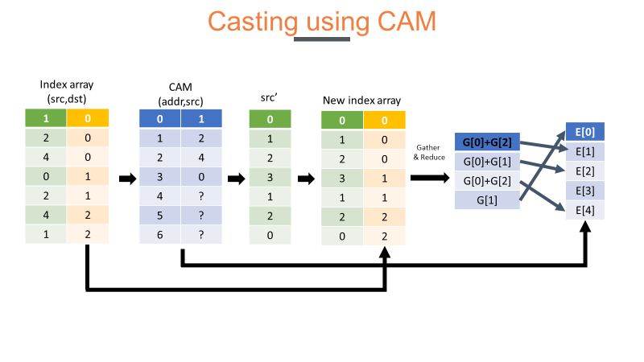

# Introduction:
recommender systems  employ “sparse” embedding layers whose compute and memory access characteristics significantly differ compared to conventional “dense” DNN layers.

In particular,personalized recommendation models for consumer facing products (e.g., e-commerce, Ads) stand out with their high memory capacity and bandwidth demands.

Because of the embedding tables they utilize, the memory capacity demands of state-of-the-art recommendation models are in the order of several tens to thousands of GBs,

# Motivation

## Latency issue:
- After adding NMP unit, casting consumes a large proportion of training time

## Energy issue:
- Using too much DIMMs to train, which consumes a lot of energy

# Architecture:

# Casting:

Using CAM to acceleratecasting procedure.
