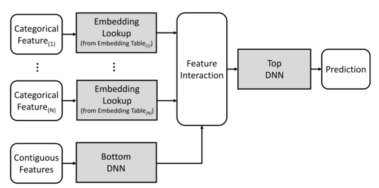
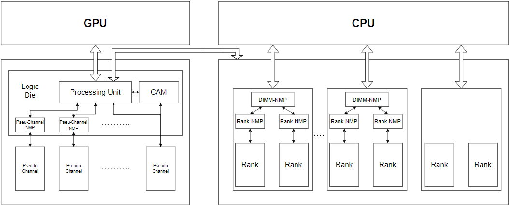
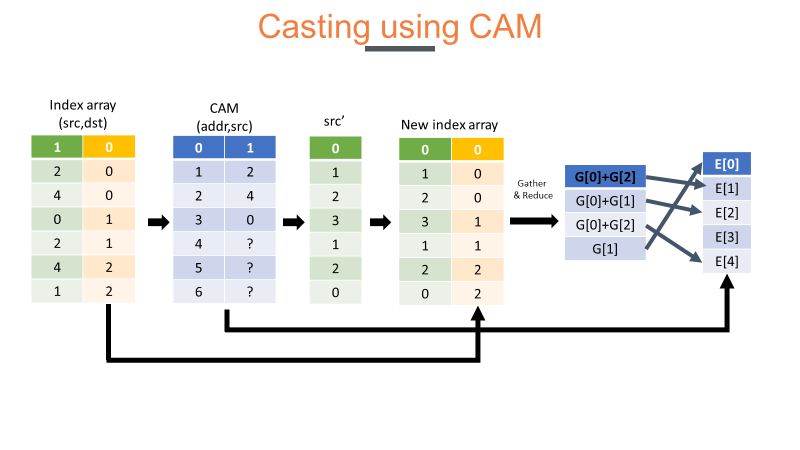

# Introduction:
Recommendation systems play a crucial role in various domains such as e-commerce and advertising by providing personalized recommendations to users. These systems heavily rely on sparse embedding layers, which differ significantly in terms of compute and memory access compared to conventional dense neural network layers.

In particular, state-of-the-art recommendation models for consumer-facing products face challenges due to their high memory capacity and bandwidth demands. The large embedding tables they utilize result in memory capacity requirements ranging from several tens to thousands of gigabytes.

# Motivation

## Latency issue:
- After adding NMP unit to accelerate recommender system training, casting casting becomes the bottleneck of training process.

## Energy issue:
- Training recommender systems often requires a significant number of DIMMs (Dual In-Line Memory Modules), leading to high energy consumption. This energy demand can be impractical and expensive, necessitating the need for energy-efficient solutions.

# Architecture:

# Casting:

To accelerate the casting procedure, we leverage Content-Addressable Memory (CAM) technology. CAM enables efficient indexing and retrieval of embedding values, reducing memory access latency and improving the overall efficiency of the casting process.
