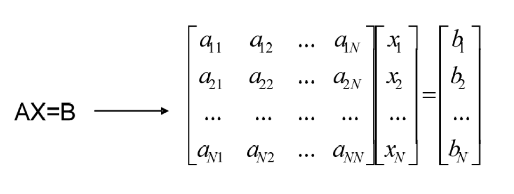
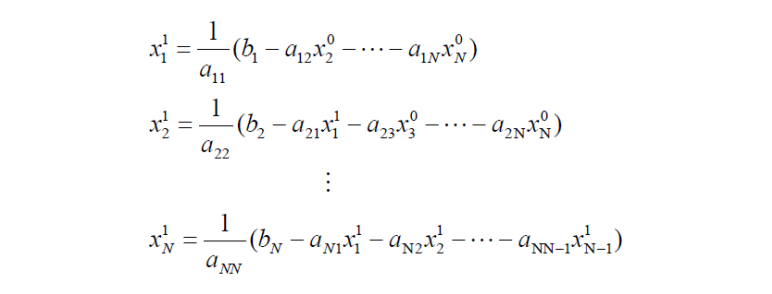
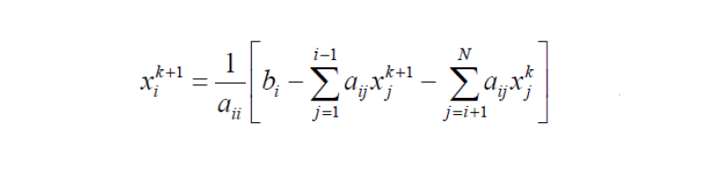
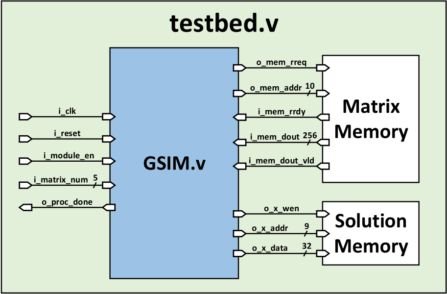

# Function:
<!--  -->

## To solve the values of x1 , x2 , …, xN, we can organize the above formula into the following formula:

<!--  -->
## Gauss-Seidel Iteration is to iterate the above formula for several times with the same action, and its behavior is shown in the following formula. value, the x value is the desired value,
<!--  -->

# Architecture:

<!--  -->

