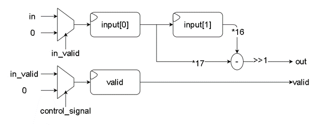
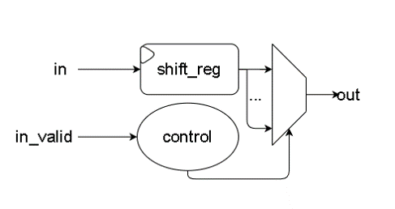
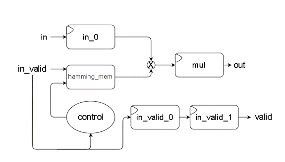
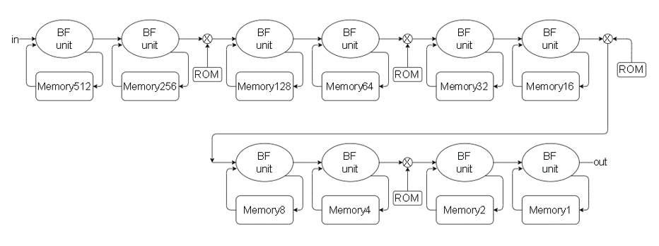
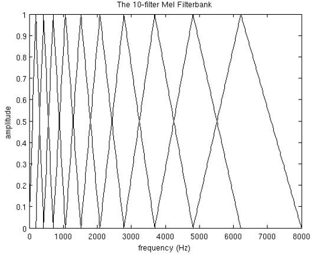
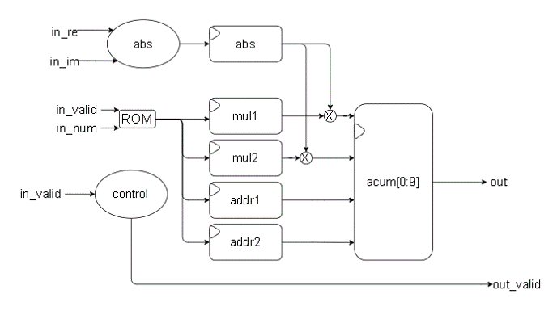
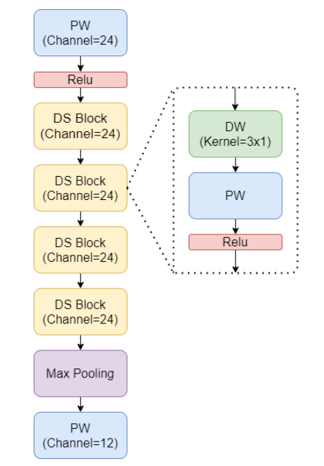
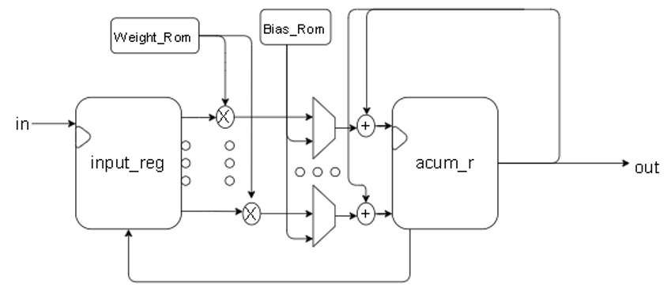

# Pre-emphasis:
Pass the speech signal s(n) through a high-pass filter:  

 H(z)=1-a*z-1 

where a is between 0.9 and 1.0. If it is expressed in terms of time domain arithmetic, the pre-emphasized signal s2(n) is 

 s2(n) = s(n) - a*s(n-1) 

The purpose is to eliminate the effects of vocal cords and lips during vocalization, to compensate for the high-frequency part of the speech signal that is suppressed by the vocal system.

## Circuit

The way I implemented was 

 s2(n) = (17*s(n) - 16*s(n-1))/2 

# Framing:
First, collect N sampling points into an observation unit, which is called a frame, usually the value of N is 256 or 512, and the time covered is about 20~30 ms. 

In order to avoid too much change between two adjacent sound boxes, we will make an overlapping area between two adjacent sound boxes, this overlapping area contains M sampling points, usually the value of M is about half of N or 1/ 3. Usually, the sampling frequency of audio used in speech recognition is 8 KHz or 16 KHz. For 8 KHz, if the length of the sound frame is 256 sampling points, the corresponding time length is 256/8000*1000 = 32 ms.

## Circuit

I use the shift register to save the data sent from the framing circuit, then combine these data into a frame.

# Hamming_window:
Multiply each frame by a Hamming window to increase continuity at the left and right ends of the frame. Suppose the framed signal is S(n), n = 0,…N-1. Then multiplied by the Hamming window, S'(n) = S(n)*W(n), and the form of this W(n) is as follows:

 W(n,a) = (1-a) - a*cos(2pn/(N-1))，0≦n≦N-1 

## Circuit

Using hamming_mem to store constants for trigonometric functions, and multiply by the input signal.

# R22SDF:
Since the change of the signal in the time domain (Time domain) is usually difficult to see the characteristics of the signal, it is usually converted into the energy distribution in the frequency domain (Frequency domain) for observation. 

Different energy distributions can represent different speech sounds. characteristic. So after multiplying the Hamming window, each sound frame must go through FFT again to get the energy distribution on the spectrum.

## Circuit

Using Radix-2^2 Single Path Delay Feedback FFT to efficiently implement FFT circuit

# Mel Filter
Multiply the energy spectrum energy by a set of 20 triangular bandpass filters to find the log energy (Log Energy) of the output of each filter. It must be noted that these 20 triangular bandpass filters are evenly distributed on the "Mel Frequency", and the relationship between the Mel frequency and the general frequency f is as follows:

 
## Circuit

Take the absolute value of the FFT output and pass it through the mel filter
# Architecture:

DSCNN[1]

 
While standard convolution performs the channelwise and spatial-wise computation in one step, Depthwise Separable Convolution splits the computation into two steps: depthwise convolution applies a single convolutional filter per each input channel and pointwise convolution is used to create a linear combination of the output of the depthwise convolution. [2]

# Design

Reference

[1]Yu-Ming Tu., Tsung-Te Liu. Hardware-Efficient Keyword Spotting System(2022) 
[2]https://paperswithcode.com/method/depthwise-separable-convolution