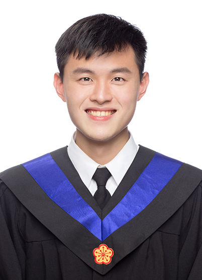

---
# the default layout is 'page'
icon: fas fa-info-circle
order: 1
try: a
---

<!--  -->
# Education:
B.S.,  in Department of Electrical Engineering, 2018, National Taiwan University

# About Me

I am currently a graduate student at the **National Taiwan University Department of Electrical Engineering**. In university, I joined the **Energy-Efficient Circuits and Systems Lab (EECS Lab)** to develop energy-efficient machine learning accelerators that can reduce the power consumption of IoT devices. Later, I did an internship at **Academia Sinica** (an eminent research institute in Taiwan) where I researched compute-in-memory architecture. I became familiar with low-power circuit design. I plan to continue exploring **machine learning accelerators in IoT devices** in my master’s studies.